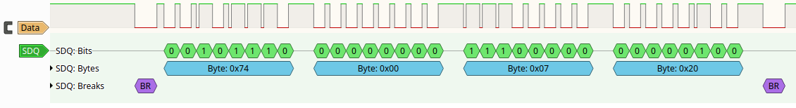

Sigrok protocol decoder for the SDQ protocol. This is used in, for example,
Apple devices with Lightning connectors.

Screenshot from PulseView:


# Installation

The easiest way to use this protocol decoder is to drop it in its own
subdirectory under `~/.local/share/libsigrokdecode/decoders` (Linux) or
`%ProgramData%\libsigrokdecode\decoders` (Windows). Create the directory
if it does not exist.

Example:
```sh
mkdir -p ~/.local/share/libsigrokdecode/decoders
cd ~/.local/share/libsigrokdecode/decoders
git clone https://github.com/pakesson/sigrok-sdq-decoder.git sdq
```
